# OpsPilot AI

### Agentic AI-Powered DevOps Assistant

OpsPilot AI is a full-stack web application built to explore the intersection of AI, DevOps, and modern software engineering.

The idea started with a simple observation: developers spend a lot of time jumping between logs, documentation, monitoring dashboards, and deployment pipelines whenever something goes wrong. I wanted to build a platform that could act as an intelligent operational assistant, helping developers troubleshoot issues, analyze logs, and interact with an AI-powered system from a single interface.

Beyond the AI functionality, this project was also an opportunity to implement real-world engineering practices such as containerization, CI/CD automation, self-hosted GitHub runners, and VPS deployments.

---

# Project Goals

The primary goals of this project were:

* Build a production-style full-stack application
* Integrate AI-powered workflows into a developer-focused product
* Implement secure authentication and user management
* Containerize services using Docker
* Deploy on a Linux VPS
* Automate deployments using GitHub Actions
* Gain hands-on experience with DevOps practices

---

# Features

## Authentication & User Management

* User Registration
* User Login
* JWT Authentication
* Protected Routes
* Password Hashing using bcrypt

---

## Agentic AI Assistant

The core of OpsPilot AI is an AI-powered assistant designed to help users navigate operational and development-related tasks.

Features include:

* Conversational AI Interface
* Context-Aware Responses
* Development Assistance
* Troubleshooting Guidance
* Operational Workflow Support

Rather than functioning as a simple chatbot, the goal is to evolve the platform into an Agentic AI assistant capable of assisting developers throughout the software lifecycle.

---

## Log Upload & Analysis

Users can upload log files directly through the platform.

This feature lays the foundation for future AI-driven log analysis and incident investigation workflows.

Current capabilities include:

* Log File Uploads
* File Processing Workflow
* Operational Data Handling

---

## Dashboard

The application includes a centralized dashboard that serves as the primary workspace for users.

The dashboard provides access to:

* AI Assistant
* File Upload System
* User Operations
* Account Management

---

# Technology Stack

## Frontend

* Next.js 16
* React 19
* TypeScript
* Tailwind CSS
* Axios
* React Hook Form
* Zod

## Backend

* Node.js
* Express.js
* MongoDB
* Mongoose
* JWT Authentication
* Multer
* OpenAI SDK

## DevOps & Infrastructure

* Docker
* Docker Compose
* GitHub Actions
* Self-Hosted GitHub Runner
* Nginx
* Debian Linux VPS

---

# Architecture

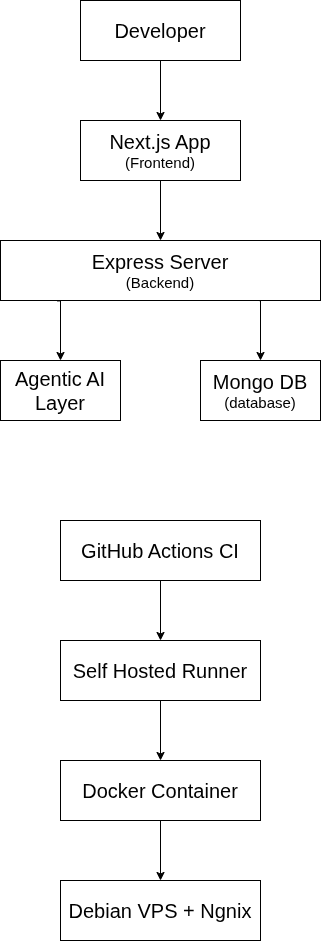

The platform follows a modern client-server architecture.

1. Users interact with the Next.js frontend.
2. Requests are sent to the Express backend through REST APIs.
3. Authentication and application data are managed through MongoDB.
4. AI requests are processed through the AI service layer.
5. The application is containerized using Docker and deployed on a Linux VPS.
6. GitHub Actions automatically rebuild and redeploy services whenever new code is pushed.

---

# Application Screenshots

## Home Page

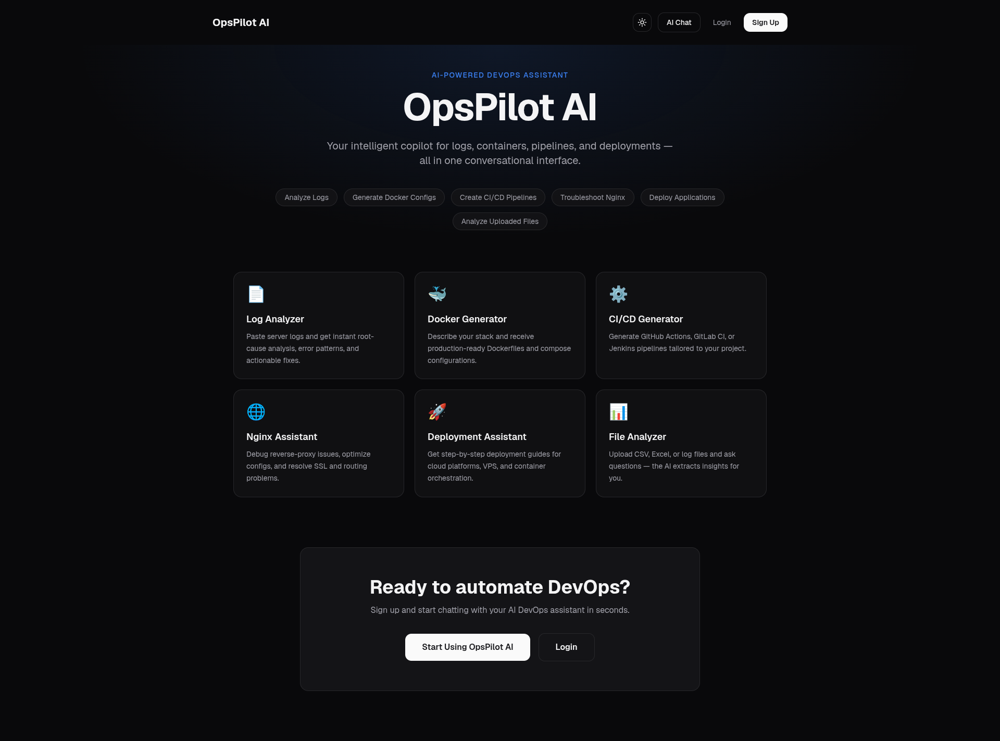

---

## Login Page

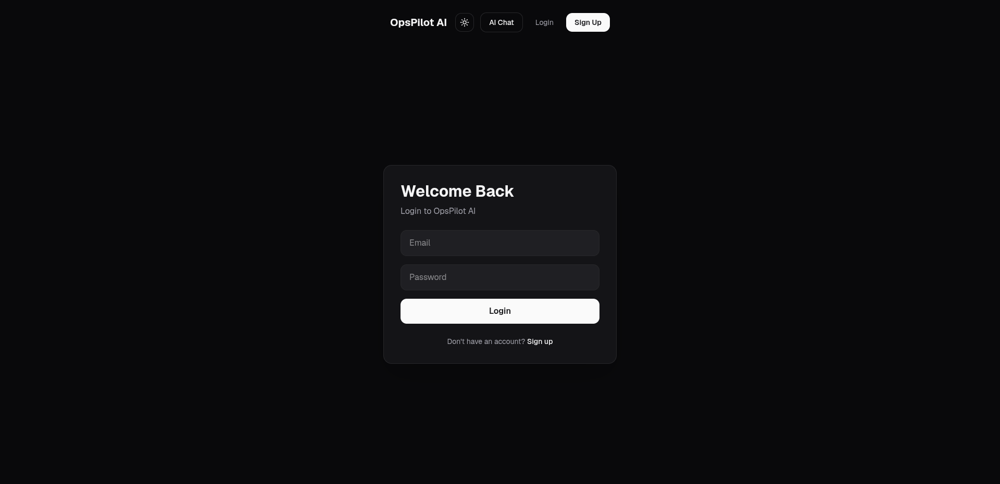

---

## Registration Page

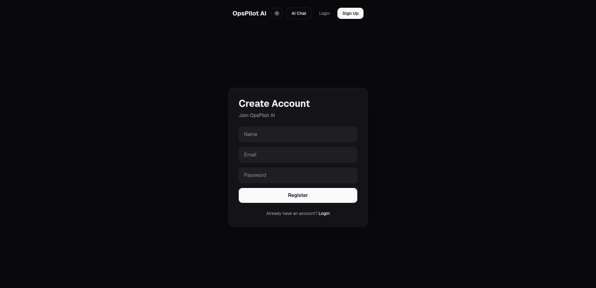

---

## Dashboard

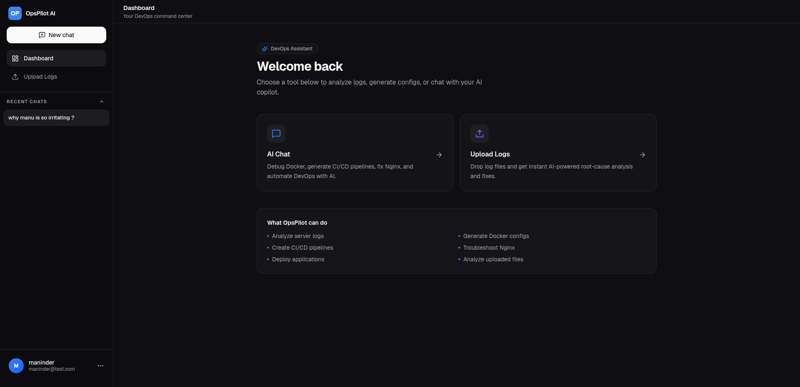

---

## Agentic AI Chat

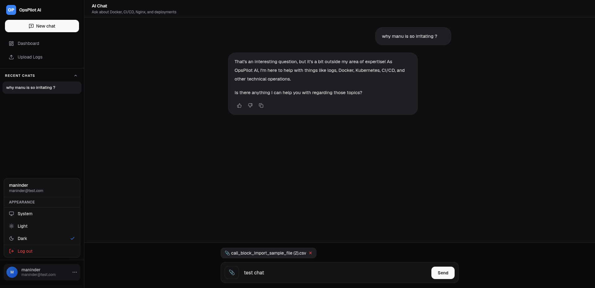

---

## Log Upload

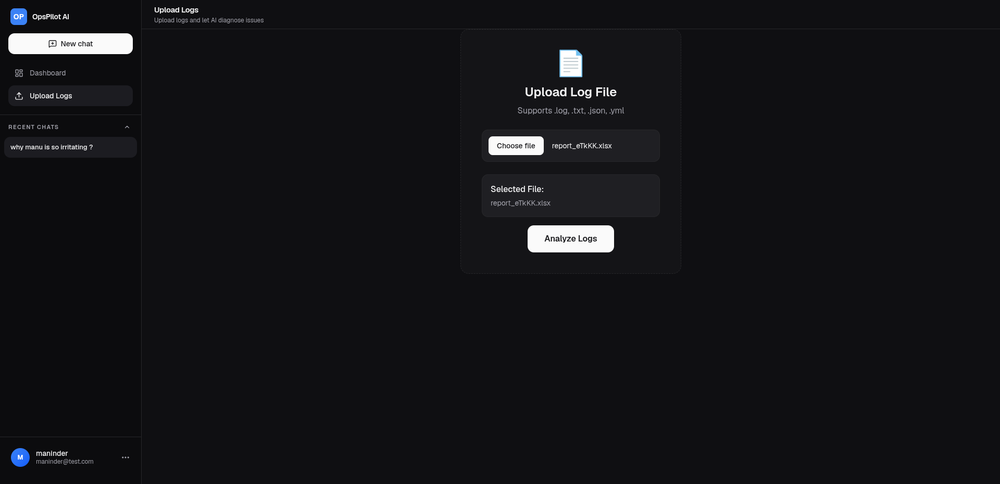

---

# CI/CD Pipeline

One of the most interesting parts of this project was setting up automated deployments using GitHub Actions and a self-hosted runner running on my VPS.

The deployment workflow is straightforward:

1. Push code to GitHub.
2. GitHub Actions triggers the deployment workflow.
3. The self-hosted runner executes the deployment jobs.
4. Docker containers are rebuilt.
5. Updated services are deployed automatically.

This allows both frontend and backend services to be deployed without manual intervention.

## Frontend Deployment Workflow

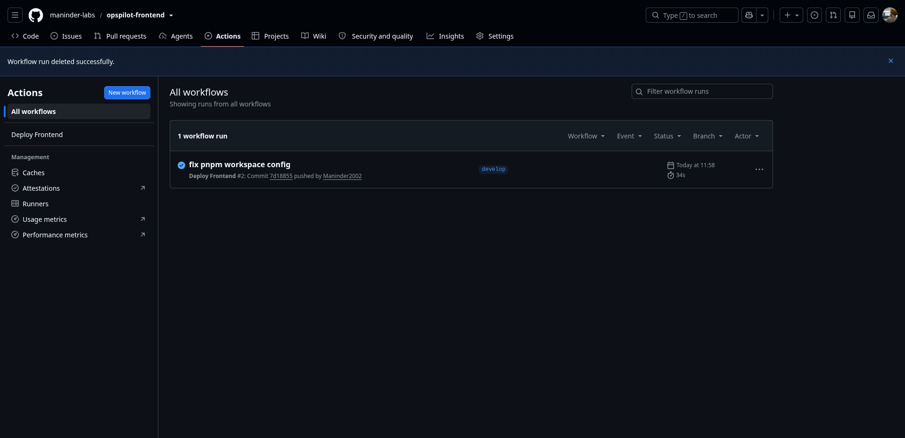

---

## Backend Deployment Workflow

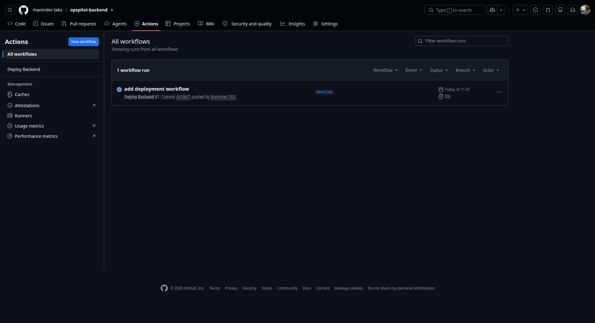

---

## Self-Hosted GitHub Runner

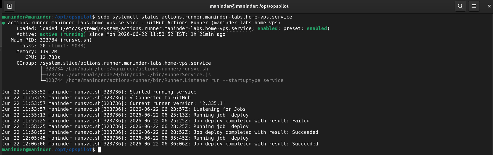

---

# Docker Deployment

The complete application runs inside Docker containers on a Debian VPS.

Services include:

* Frontend Container
* Backend Container
* MongoDB Container

## Running Containers

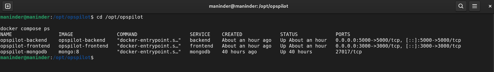

---

## Container Resource Usage

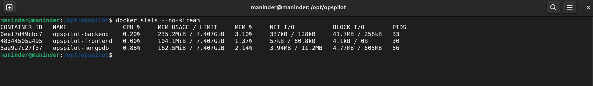

---

# Repository Structure

This project is maintained using separate repositories for frontend and backend development.

### Frontend Repository

https://github.com/maninder-labs/opspilot-frontend

### Backend Repository

https://github.com/maninder-labs/opspilot-backend

### Project Showcase Repository

This repository serves as the central documentation and showcase for the project.

---

# What I Learned

Building OpsPilot AI helped me gain practical experience in:

* Full Stack Development
* REST API Design
* JWT Authentication
* MongoDB & Mongoose
* Docker Containerization
* Docker Compose
* CI/CD Pipelines
* Self-Hosted GitHub Runners
* VPS Deployment
* AI Application Development
* Modern Next.js Development

More importantly, it provided hands-on experience with the type of tooling and workflows commonly used in modern engineering teams.

---

# Future Improvements

Planned enhancements include:

* Multi-Agent AI Workflows
* AI-Powered Log Analysis
* Incident Investigation Assistant
* Infrastructure Recommendations
* Kubernetes Support
* Monitoring Integrations
* Team Collaboration Features
* Automated Operational Reports

---

# Author

**Maninderpal Singh**

Full Stack Developer | DevOps Enthusiast | AI Engineer

GitHub: https://github.com/Maninder2002
